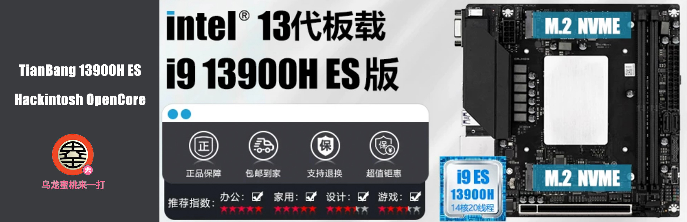

## 天邦 13900H ES ITX 黑苹果 OpenCore EFI



[OpenCore 1.0.0](https://github.com/acidanthera/OpenCorePkg)


### macOS

- Ventura
- Monterey
- Sonoma


### 硬件

- BIOS版本: Leo Bios
- 处理器: 英特尔13代 i9-13900H ES
- 内存: 科赋 CJR 16GB(8GB*2) DDR4 4000 Mhz
- 显卡: AMD RX480 8G
- 声卡: 瑞昱 ALC897
- 有线网卡: 瑞昱 RTL8125 Gaming 2.5GbE
- 有线网卡: 瑞昱 RTL8111
- 无线网卡: 94360NG
- 处理器散热: 利民 AXP120 + 猫头鹰 1215


### BIOS设置

```
禁用 CSM
禁用 Fast Boot
禁用 Secure Boot
禁用 VT-D
打开 4G以上解码
打开 Re-Size BAR Support
打开 开启4G以上 MMIO BIOS分配
```

### 注意事项

 - 安装成功后必须使用 [OCAuxiliaryTools](https://github.com/ic005k/OCAuxiliaryTools) 生成你自己的 SMBIOS
 - 使用博通网卡安装Sonoma的用户请自行修改EFI、添加博通无线驱动并使用OCLP补丁
 - 使用英特尔无线网卡的用户请自行根据MacOS版本添加[英特尔无线](https://hackintosh.club/d/10000015)和[蓝牙驱动](https://hackintosh.club/d/10000017)

### 参考内容

[1.黑苹果安装过程演示](https://hackintosh.club/d/10000060)

[2.英特尔无线网卡WiFi驱动](https://hackintosh.club/d/10000015)

[3.英特尔无线网卡蓝牙驱动](https://hackintosh.club/d/10000017)

[4.我的B站黑苹果教程](https://space.bilibili.com/244390800/video)

[6.黑果之家](https://hackintosh.club/)

### 联系我们

QQ Group: 23304408


### 常用工具

- [Hackintool](https://github.com/headkaze/Hackintool) 
- [OCAuxiliaryTools](https://github.com/ic005k/OCAuxiliaryTools) AKA `OCAT`.
- [OpenCore Configurator](https://mackie100projects.altervista.org/opencore-configurator/) AKA `OCC`.
- [gibMacOS](https://github.com/corpnewt/gibMacOS) Build your own MacOS image.
- [ProperTree](https://github.com/corpnewt/ProperTree) Plist editor.
